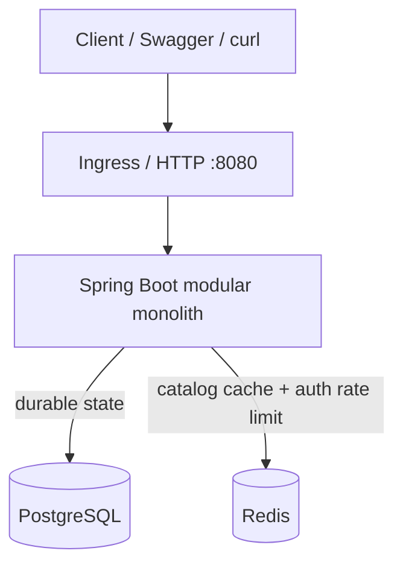
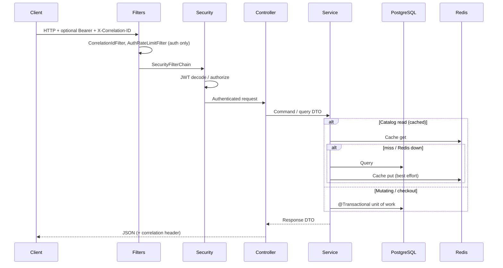
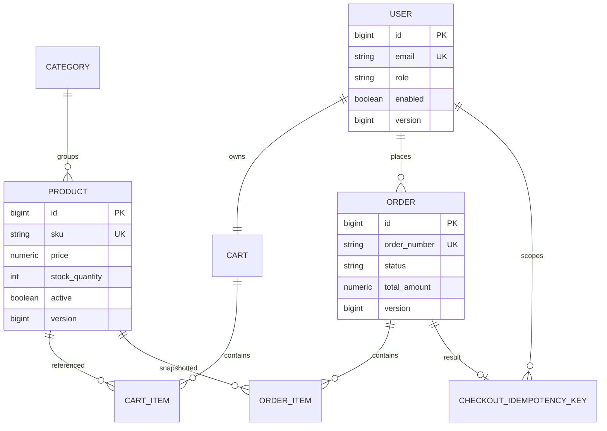

# Architecture

CartForge is a **modular monolith**: one Spring Boot process, feature packages as module boundaries, PostgreSQL as the source of truth, and Redis as a fail-open cache and auth rate-limit store.

This document describes the **implemented** system.

## Purpose

- Expose a versioned REST API (`/api/v1`) for an online store.
- Keep domains maintainable without microservice distribution.
- Prefer correctness (transactions, optimistic locking, ownership checks) over artificial complexity.

## Runtime topology



- Clients speak HTTP only.
- One JVM owns every business domain.
- PostgreSQL stores users, catalog, carts, orders, and checkout idempotency keys.
- Redis is optional for correctness: cache and rate limiting fail open when Redis is unavailable.

## Modular monolith and module boundaries

```text
src/main/java/com/example/ecommerce/
├── auth/          # register, login, JWT issuance
├── user/          # User entity, repository, DTOs (no public profile controller)
├── category/      # category CRUD + public list/get
├── product/       # product CRUD + search/filter/sort/page
├── cart/          # customer cart aggregate
├── order/         # checkout, customer orders, /api/v1/admin/orders
├── inventory/     # internal stock operations on Product (no HTTP API)
└── common/        # security, errors, pagination, cache, logging, config
```

| Package | Boundary |
|---|---|
| `auth` | HTTP auth; password hashing; JWT issue via `JwtTokenService` |
| `user` | Persistence and role model; used by auth and ownership |
| `category` | Catalog grouping; cache reads/writes |
| `product` | Catalog SKUs, money, stock field, search; optimistic `@Version` |
| `inventory` | `validateAvailability` / increase / decrease / restore on `Product` |
| `cart` | One cart per user; line items; no stock reservation |
| `order` | Checkout transaction, snapshots, cancel, admin status |
| `common` | Cross-cutting only — not a business domain |

Administration is not a separate package. Admin HTTP lives on the owning feature (`product`/`category` writes, `order` → `AdminOrderController`).

### Layering (enforced in code)

- Controllers: HTTP + validation mapping; no business rules; no `@Transactional`.
- Services: business rules and transaction boundaries.
- Repositories: Spring Data / custom queries only.
- Entities: never returned from controllers.
- DTOs + manual mappers at the API boundary.

## Request flow



Typical filter / handler order:

1. `CorrelationIdFilter` — accept or generate `X-Correlation-ID`
2. `AuthRateLimitFilter` — login/register only; Redis fixed window; fail-open
3. Spring Security — JWT resource server; method security (`@RequireAdmin`)
4. Controller → service → repository
5. `@RestControllerAdvice` — uniform `ApiErrorResponse`

## Domain model (relationships)



## Consistency

### Transaction boundaries

Services own `@Transactional`. Controllers never open transactions.

| Operation | Service | Notes |
|---|---|---|
| Checkout | `OrderService` | Cart lock → validate → order + lines → decrease stock → clear cart → optional idempotency row ([ADR 0009](adr/0009-transactional-checkout.md)) |
| Cancel | `OrderService` | Status transition + inventory restore |
| Admin status | `AdminOrderService` | Validated `OrderStatus` transitions |
| Inventory | `InventoryService` | Increase / decrease / restore |
| Cart mutations | `CartService` | Persist cart aggregate |
| Catalog writes | `ProductService` / `CategoryService` | Evict Redis keys after commit path |

### Optimistic locking

`Product`, `User`, and `Order` extend `VersionedEntity` (`@Version`). Concurrent stock updates raise `OptimisticLockingFailureException`, mapped to HTTP 409. PostgreSQL `ck_products_stock_quantity_non_negative` is the last guard.

See [ADR 0004](adr/0004-optimistic-locking.md).

### Checkout idempotency

Optional header `Idempotency-Key` on `POST /api/v1/orders`:

- Stored in `checkout_idempotency_keys` in the **same** checkout transaction ([ADR 0007](adr/0007-checkout-idempotency.md)).
- Unique on `(user_id, idempotency_key)`.
- Concurrent retries take `pg_advisory_xact_lock`.
- Equivalent body fingerprint → replay original order; different body → HTTP 409.
- Omitting the header keeps non-idempotent checkout.

### Redis caching

Catalog caches ([`CatalogCaches`](../src/main/java/com/example/ecommerce/common/cache/CatalogCaches.java)):

| Cache name | Key shape | Example |
|---|---|---|
| `product` | `{id}` | `product:42` |
| `category` | `{id}` | `category:7` |
| `products` | query hash from `ProductSearchCriteria.cacheKey()` | `products:{hash}` |
| `categories` | `active` | `categories:active` |

Writes `@CacheEvict` affected entries (and list caches). Redis outage → log warning, read PostgreSQL ([ADR 0003](adr/0003-redis-as-cache.md)). Auth rate limiting also fails open ([ADR 0008](adr/0008-auth-rate-limiting.md)).

Spring’s Redis health indicator is disabled for readiness; `FailOpenRedisHealthIndicator` (`redisAvailability`) reports availability without marking the process DOWN.

## API surface (implemented)

| Area | Paths |
|---|---|
| Auth | `POST /api/v1/auth/register`, `POST /api/v1/auth/login` |
| Categories | `GET` public; `POST/PUT/PATCH/DELETE` admin |
| Products | `GET` list/get public; writes admin; search query params |
| Cart | `/api/v1/cart` (+ items) — authenticated customer |
| Orders | `POST/GET/cancel` customer; `/api/v1/admin/orders` admin |
| Actuator | `/actuator/health/**`, `/actuator/prometheus` public; other actuator denied |

**Not implemented:** dedicated user-profile HTTP API (`/users/me`), automatic seed users.

## Cross-cutting

- JWT Bearer; ownership from `CurrentUserProvider` (`sub` claim)
- Jakarta Validation at the edge
- Allowlisted sort fields; max page size
- Correlation ID on responses and error JSON
- Actuator readiness includes `db`; liveness is process-only
- Logging redacts passwords and tokens

## Non-goals

No microservice mesh, payment processor, or external search cluster. See `SPECIFICATIONS.md` §4.

## Related documents

- [database.md](database.md)
- [security.md](security.md)
- [deployment.md](deployment.md)
- [adr/](adr/) — ADRs 0001–0010 (monolith, PostgreSQL, Redis, locking, JWT, Helm, idempotency, rate limit, checkout txn, CI/CD)
