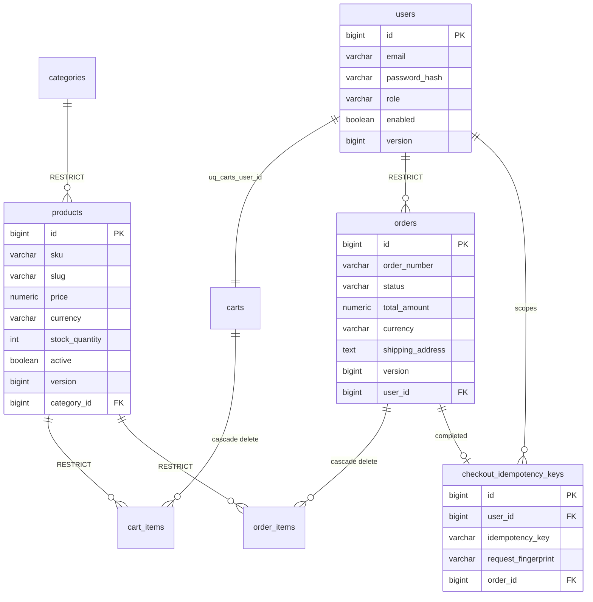
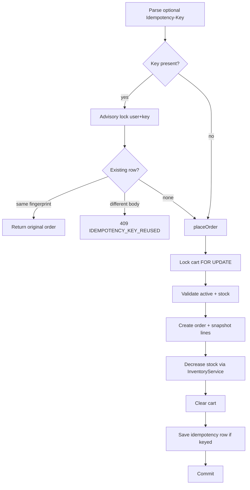

# Database

PostgreSQL is the authoritative persistence layer. Redis is never durable business state ([ADR 0002](adr/0002-postgresql-source-of-truth.md), [ADR 0003](adr/0003-redis-as-cache.md)).

Shared Java types live in `com.example.ecommerce.common.persistence`. Entities follow these conventions; do not introduce a second persistence style.

## Engine and ownership

| Topic | Implementation |
|---|---|
| Engine | PostgreSQL |
| Migrations | Flyway `V1`–`V10` under `src/main/resources/db/migration` |
| Hibernate | `ddl-auto=validate` in every profile |
| Schema creation | Flyway only — Hibernate does not create tables |
| Timestamps | `java.time.Instant` ↔ `timestamptz` (UTC) |
| Money | `java.math.BigDecimal` ↔ `NUMERIC(19, 2)` |

## Logical model



## Persistence conventions

### Primary keys

- Column: `id BIGINT GENERATED BY DEFAULT AS IDENTITY`
- Constraint: `pk_<table>`
- Java: `Long` on `BaseEntity` with `GenerationType.IDENTITY`
- Public business ids (e.g. `order_number`) are separate unique columns

`User` is a reserved word — table names are always explicit plural `@Table(name = "...")`.

### Timestamps

- `created_at` / `updated_at` `timestamptz NOT NULL`
- `@CreationTimestamp` / `@UpdateTimestamp` on `BaseEntity`
- `hibernate.jdbc.time_zone=UTC`
- API JSON: ISO-8601

### Naming

| Kind | Rule | Example |
|---|---|---|
| Table | plural `snake_case` via `@Table` | `users`, `cart_items` |
| Column | `snake_case` / Java `camelCase` | `stock_quantity` |
| PK | `pk_<table>` | `pk_products` |
| FK | `fk_<table>_<referenced_table>` | `fk_products_categories` |
| Unique | `uq_<table>_<columns>` | `uq_products_sku` |
| Check | `ck_<table>_<rule>` | `ck_products_price_non_negative` |
| Index | `ix_<table>_<columns>` | `ix_products_category_id` |

Hibernate `CamelCaseToUnderscoresNamingStrategy` converts fields → columns but does **not** pluralize tables.

### Foreign keys

- Real PostgreSQL FKs on every relationship column
- Default: `ON DELETE RESTRICT`
- `ON DELETE CASCADE` only for composition (`cart_items` → cart, `order_items` → order)
- Category delete does not cascade to products; service rejects or reassigns first

### Unique constraints (implemented)

| Constraint | Purpose |
|---|---|
| `uq_users_email_lower` | Case-insensitive email (`LOWER(email)`) |
| `uq_categories_name` / `uq_categories_slug` | Category identity |
| `uq_products_sku` / `uq_products_slug` | Product identity |
| `uq_carts_user_id` | One cart per user |
| `uq_cart_items_cart_id_product_id` | One line per product per cart |
| `uq_orders_order_number` | Human-readable order id |
| `uq_checkout_idempotency_user_key` | Idempotency per user |

### Optimistic locking

| Entity | Version column |
|---|---|
| `User` | yes (`VersionedEntity`) |
| `Product` | yes — concurrent stock / catalog updates |
| `Order` | yes — concurrent cancel / status |
| Category, Cart, CartItem, OrderItem | no |

Stale updates → `OptimisticLockingFailureException` → HTTP 409.  
`ck_products_stock_quantity_non_negative` remains the last stock guard.

See [ADR 0004](adr/0004-optimistic-locking.md).

### Money

- Never `float` / `double`
- Amounts: `NUMERIC(19, 2)` + `BigDecimal`
- Currency: `VARCHAR(3)` ISO 4217 (`CurrencyCode`), default `EUR`
- Non-negative amounts: check constraints where required
- Order lines snapshot `unit_price`; `ck_order_items_line_total` enforces `line_total = unit_price * quantity`

### Indexes (minimum)

```text
users.email                 → uq_users_email_lower
products.sku / slug         → unique constraints
products.category_id        → ix_products_category_id
products.active / price / name
categories.slug             → unique
orders.order_number         → unique
orders.user_id / status
cart_items.product_id
products.search_text        → generated column for ILIKE search (V7)
```

Product text search uses case-insensitive `LIKE` on `search_text`. Leading-wildcard patterns will not use btree efficiently; accepted at portfolio scale.

## Migrations

Location: `src/main/resources/db/migration`

```text
V1__schema_baseline.sql
V2__create_users.sql
V3__create_categories.sql
V4__create_products.sql
V5__create_carts.sql
V6__create_orders.sql
V7__product_search.sql
V8__categories_active_index.sql
V9__order_number_sequence.sql
V10__checkout_idempotency.sql
```

Rules: integer versions, immutable after commit, one concern per file, no Hibernate “repair”.

## Domain tables (implemented)

### `users` — `VersionedEntity`

Email unique case-insensitively (stored lowercase). `password_hash` only. Roles `CUSTOMER` | `ADMIN` (`ck_users_role`). Default registration role `CUSTOMER`, `enabled=true`. API: `UserResponse` (no hash).

### `categories` — `BaseEntity`

Unique name/slug; URL-safe slug check. Optional `description`. Public list is active-only. Delete rejected when products exist; `reassignAndDelete` moves products first. Prefer `active=false` for historical references.

### `products` — `VersionedEntity`

Unique SKU/slug; non-negative price and stock; FK to category `RESTRICT`. Inactive / zero-stock products are not purchasable. Lazy `category` with `@EntityGraph` on catalog finders. Search via `search_text` (V7).

### `carts` / `cart_items` — `BaseEntity`

One cart per user. Positive quantity. Unique `(cart_id, product_id)`; `addOrIncrease` merges lines. **No inventory reservation.** Cart is aggregate root (`cascade ALL`, orphan removal). Cart contents validated again at checkout.

### `orders` / `order_items` — Order is `VersionedEntity`

- `order_number` format `ORD-YYYY-NNNNNN` from sequence `order_number_seq` (`OrderNumberGenerator`, V9)
- Status lifecycle on `OrderStatus` (`canTransitionTo`, `isCancellable`)
- Totals recomputed from line snapshots
- Lines snapshot `product_name`, `sku`, `unit_price` at checkout
- Customer cancel allowed for `PENDING` / `CONFIRMED` only

### `checkout_idempotency_keys` (V10)

Written only on successful checkout with `Idempotency-Key`. Columns include `user_id`, `idempotency_key`, `request_fingerprint` (SHA-256 of body), `order_id`. See [ADR 0007](adr/0007-checkout-idempotency.md).

## Transactions

Services own `@Transactional`. Controllers do not.

### Checkout (single transaction)



Also transactional: order cancellation (restore stock), inventory mutations, admin status updates, cart mutations.

Default PostgreSQL isolation. No remote I/O inside the checkout transaction.

## Inventory storage

Inventory is `products.stock_quantity`. `InventoryService` provides validate / increase / decrease / restore. No inventory table and no public inventory HTTP API.

## Seed data

No automatic seed users or catalog bootstrap is shipped. Production must never load development credentials automatically. Provision `ADMIN` out-of-band when needed.

## Related documents

- [architecture.md](architecture.md)
- [security.md](security.md)
- [ADR 0002](adr/0002-postgresql-source-of-truth.md)
- [ADR 0004](adr/0004-optimistic-locking.md)
- [ADR 0007](adr/0007-checkout-idempotency.md)
- [ADR 0009](adr/0009-transactional-checkout.md)
