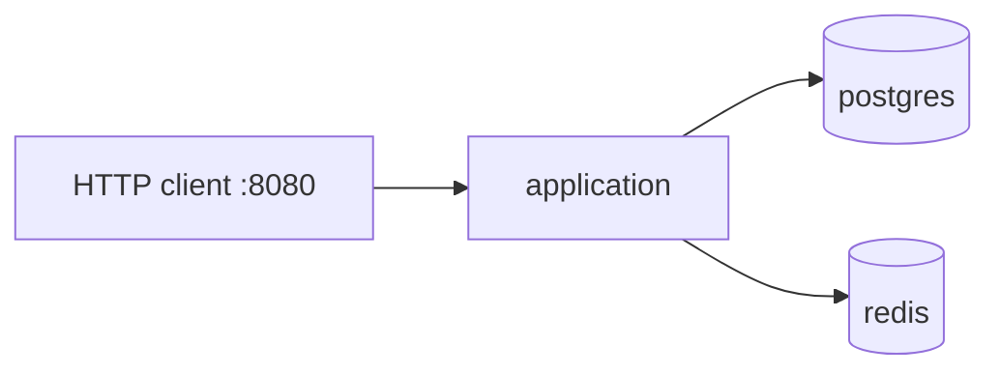
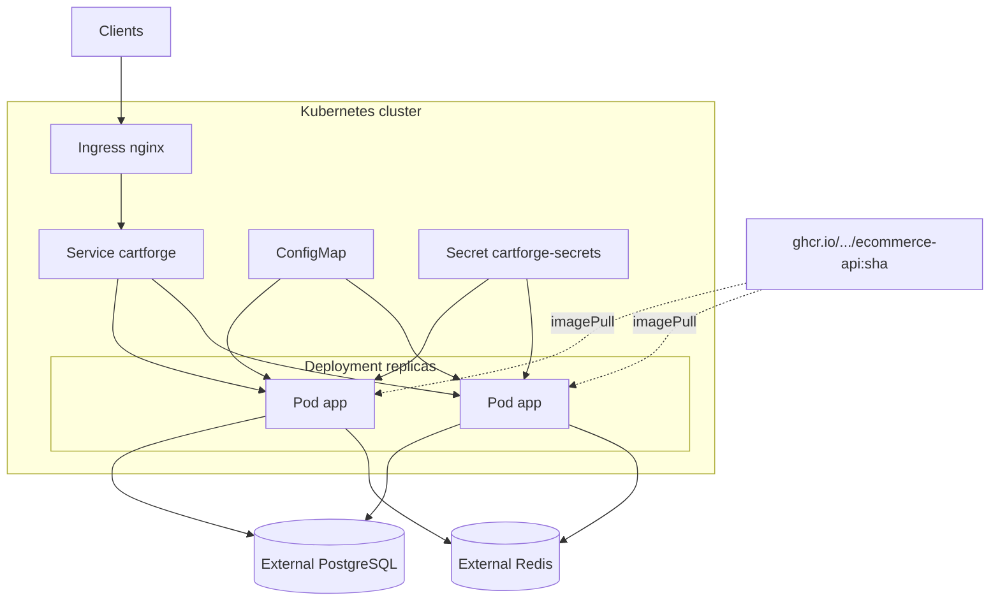
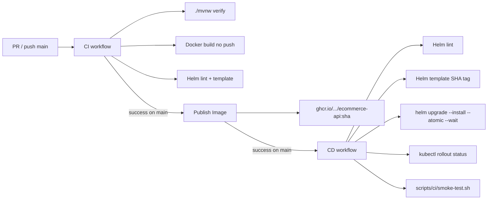

# Deployment

How CartForge is packaged and delivered. Artifacts live in the repository: Docker image, Compose stack, raw Kubernetes manifests (`k8s/`), Helm chart (`helm/cartforge`), and GitHub Actions workflows.

This document describes the **implemented** delivery path.

## Local stack

```bash
cp .env.example .env
./mvnw package -DskipTests
docker compose up --build
```

Compose services: `application`, `postgres`, `redis`. Configuration comes from environment variables (see `.env.example`).



## Container image

Production image properties:

- multi-stage build (`Dockerfile`);
- non-root runtime (UID 10001);
- no secrets in the image;
- readiness/liveness health checks;
- SIGTERM / graceful shutdown.

Published image reference:

```text
ghcr.io/<owner>/ecommerce-api:<git-sha>
```

Optional convenience tag on successful main publishes:

```text
ghcr.io/<owner>/ecommerce-api:latest
```

Production deploys must use the immutable SHA tag, never `latest`.

## Kubernetes topology

Preferred production packaging is the Helm chart. Raw manifests under `k8s/` mirror the same resource kinds for reference or non-Helm experiments.



Production assumes **externally managed** PostgreSQL and Redis. In-chart `demoInfrastructure.postgres` / `redis` stay **disabled** in `values-prod.yaml`.

## Helm configuration

Chart: `helm/cartforge` (Chart.yaml `name: cartforge`).

| File | Role |
|---|---|
| `values.yaml` | Shared defaults; incomplete alone (CI expects env values) |
| `values-dev.yaml` | Local/dev-oriented rendering (demo infra may be enabled) |
| `values-prod.yaml` | Production defaults: 2 replicas, external DB/Redis, `secrets.create=false` |
| `templates/*` | Deployment, Service, Ingress, ConfigMap, Secret, ServiceAccount, optional Postgres/Redis/NetworkPolicy |

### Production values (implemented defaults)

| Setting | `values-prod.yaml` |
|---|---|
| `replicaCount` | `2` |
| `image.repository` | `ghcr.io/example/ecommerce-api` (override at deploy) |
| `image.tag` | empty in file — **required** at render (`--set image.tag=<sha>`); SNAPSHOT / Chart.AppVersion fallback removed |
| `networkPolicy.enabled` | `true` — Ingress/monitoring peers only |
| `ingress` | enabled, `className: nginx`, host/path placeholders |
| `config.springProfilesActive` | `prod` |
| `secrets.create` | `false` |
| `secrets.existingSecret` | `cartforge-secrets` |
| `demoInfrastructure.*` | all `enabled: false` |

CD always deploys with an immutable image tag and `secrets.create=false`.

### Rolling update behaviour

Chart defaults:

- `maxSurge: 1`, `maxUnavailable: 0`
- readiness `/actuator/health/readiness` (includes PostgreSQL `db`)
- liveness `/actuator/health/liveness`
- `terminationGracePeriodSeconds: 35`
- `preStop` delay before SIGTERM handling

Unready pods do not receive Service traffic. Redis outage does not fail readiness (fail-open cache / rate limit).

## CI / CD pipeline



| Workflow | Trigger | Outcome |
|---|---|---|
| `.github/workflows/ci.yml` | `pull_request`, `push` to `main` | Java verify, Docker build (no push), Helm lint/template |
| `.github/workflows/publish-image.yml` | Successful CI on `main` (`workflow_run`), or manual SHA | Push `ecommerce-api:<sha>` (+ `latest` on main) |
| `.github/workflows/cd.yml` | Successful Publish on `main`, or manual SHA | Helm deploy to Environment `production` + smoke |

A failed rollout or smoke test fails the CD workflow. Helm `--atomic` rolls the release back when the upgrade does not become ready.

### Post-deployment smoke test

`scripts/ci/smoke-test.sh` runs against the Service via `kubectl port-forward` and must succeed for CD to pass:

| Check | How |
|---|---|
| Application ready | `/actuator/health/readiness` → `UP` (includes PostgreSQL `db` probe) |
| Health | `/actuator/health` and `/actuator/health/liveness` → `UP` |
| Public catalog | `GET /api/v1/categories`, `GET /api/v1/products` → `200` |
| Authentication | `POST /api/v1/auth/login` with unknown credentials → `401` (or `429`) |
| Database | Covered by readiness (`db` in readiness group); auth login also hits the user store |
| Redis | Not required for readiness. Catalog/auth success with Redis up **or** fail-open is acceptable |

Local usage against a running stack:

```bash
./scripts/ci/smoke-test.sh http://localhost:8080
```

## Required GitHub configuration

CD uses the GitHub Environment named `production`. Create it under
**Settings → Environments → production**.

### Secrets (GitHub Environment `production`)

| Name | Required | Description |
|---|---|---|
| `KUBE_CONFIG` | yes | Kubeconfig for the target cluster. Accepts raw YAML **or** base64-encoded YAML. Never commit this value. |

The workflow authenticates to GHCR for image *publishing* with `GITHUB_TOKEN`
(Publish Image workflow). CD does not need registry push credentials.

Do **not** store `JWT_SECRET`, database passwords, or other application secrets
in GitHub Actions if they belong in the cluster Secret (see below).

### Variables (GitHub Environment `production`)

All variables are optional unless noted. When unset, Helm falls back to
`values-prod.yaml` defaults / chart defaults.

| Name | Required | Default | Description |
|---|---|---|---|
| `KUBE_NAMESPACE` | no | `cartforge` | Target namespace (`helm --create-namespace`) |
| `HELM_RELEASE_NAME` | no | `cartforge` | Helm release name |
| `APP_SECRET_NAME` | no | `cartforge-secrets` | Existing Kubernetes Secret with app credentials |
| `DATABASE_URL` | recommended | (values-prod) | JDBC URL for PostgreSQL |
| `DATABASE_HOST` | no | (values-prod) | Host used when URL is constructed / wait init |
| `DATABASE_USERNAME` | no | (values-prod) | Database username (password stays in the cluster Secret) |
| `REDIS_URL` | recommended | (values-prod) | Redis connection URL |
| `REDIS_HOST` | no | (values-prod) | Redis host |
| `CORS_ORIGINS` | recommended | (values-prod) | Explicit CORS allowlist |
| `INGRESS_HOST` | recommended | (values-prod) | Ingress hostname |
| `IMAGE_PULL_SECRET_NAME` | if GHCR private | unset | Name of a pre-created `imagePullSecret` in the namespace |

### Repository permissions

Workflows use least privilege:

| Workflow | Permissions |
|---|---|
| CI | `contents: read` |
| Publish Image | `contents: read`, `packages: write`, `actions: read` |
| CD | `contents: read` (+ environment secrets) |

## Required Kubernetes configuration

Provision these in the cluster **before** enabling CD. Nothing below belongs in Git.

### Namespace

```bash
kubectl create namespace cartforge
```

(CD can also create the namespace via Helm `--create-namespace`.)

### Application Secret

The chart expects an existing Secret (CD sets `secrets.create=false`):

```bash
kubectl create secret generic cartforge-secrets \
  --namespace cartforge \
  --from-literal=POSTGRES_PASSWORD='...' \
  --from-literal=JWT_SECRET='...' \
  --from-literal=REDIS_URL='redis://:PASSWORD@redis.example.com:6379'
```

Keys must match chart defaults (`POSTGRES_PASSWORD`, `JWT_SECRET`, plus `REDIS_URL`)
unless you override `secrets.postgresPasswordKey` / `secrets.jwtSecretKey`.

Production Ingress must include `ingress.tls` (TLS secret + hosts); the chart fails
render under the `prod` profile when TLS or NetworkPolicy is missing.

### Image pull (private GHCR packages)

If the package is private, create a pull secret and set
`IMAGE_PULL_SECRET_NAME` in the GitHub Environment:

```bash
kubectl create secret docker-registry ghcr-pull \
  --namespace cartforge \
  --docker-server=ghcr.io \
  --docker-username='<github-username>' \
  --docker-password='<PAT with read:packages>'
```

### Data stores

CD assumes externally managed PostgreSQL and Redis (connection settings via
GitHub variables / `values-prod.yaml`). In-cluster Postgres/Redis in the chart
are demo infrastructure only and stay disabled in production values.

### Ingress

An Ingress controller compatible with `ingressClassName: nginx` (or override via
values) must already exist. CD does not install an ingress controller.

## Manual deploy

After an image exists in GHCR:

```bash
# GitHub Actions → CD → Run workflow → supply full git SHA
```

Or locally (with kubeconfig and cluster Secret already present):

```bash
helm upgrade --install cartforge ./helm/cartforge \
  -n cartforge --create-namespace \
  -f helm/cartforge/values-prod.yaml \
  --set image.repository=ghcr.io/<owner>/ecommerce-api \
  --set image.tag=<git-sha> \
  --set secrets.create=false \
  --set secrets.existingSecret=cartforge-secrets \
  --atomic --wait --timeout 10m

kubectl rollout status deployment/cartforge -n cartforge
```

## Related documents

- [architecture.md](architecture.md)
- [security.md](security.md)
- [database.md](database.md)
- [ADR 0006](adr/0006-helm-kubernetes-deployment.md) — Kubernetes + Helm
- [ADR 0010](adr/0010-github-actions-cicd.md) — GitHub Actions CI/CD
