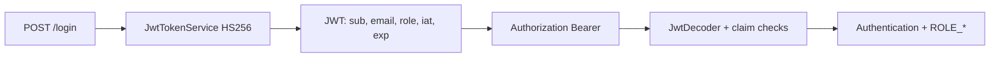
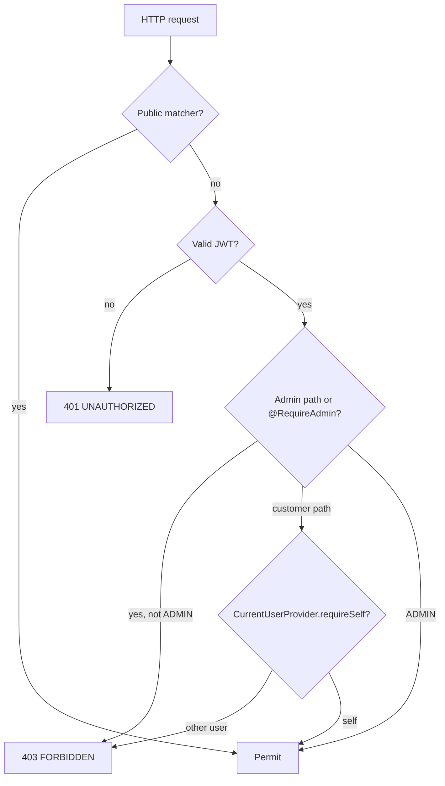

# Security

This document describes the **implemented** security model. Planned-only items are called out explicitly.

## Goals

- Authenticate with JWT Bearer tokens
- Authorize by role and ownership
- Keep secrets out of Git and container images
- Avoid leaking credentials, tokens, or stack traces via APIs or logs

## Authentication

```http
POST /api/v1/auth/register
POST /api/v1/auth/login
```

Implemented by `AuthController` → `RegistrationService` / `AuthenticationService`.

### Registration

- Validate email; password length **12–72** characters (BCrypt consumes at most 72 bytes)
- Reject duplicate email (pre-check + `uq_users_email_lower`)
- Hash with `DelegatingPasswordEncoder` (BCrypt id by default)
- Always assign `CUSTOMER` — `RegistrationRequest` has no role field
- Enable user by default
- Return `UserResponse` (never the hash)

### Login

- `authenticate` verifies credentials → `login` issues JWT → `AccessTokenResponse`
- Failed logins always raise the same `InvalidCredentialsException` (unknown email, wrong password, or disabled) to avoid user enumeration
- Unknown email still runs the encoder against a decoy hash (timing parity)
- `DatabaseUserDetailsService` loads by `lower(email)` so the functional unique index is usable

Authenticated requests:

```http
Authorization: Bearer <JWT>
```

No refresh tokens, logout denylist, password reset, or social OAuth (not required by the specification).

### JWT



| Topic | Implementation |
|---|---|
| Algorithm | HS256 only (`JwtConfig`); `none` / asymmetric / other MAC rejected |
| Secret | `JWT_SECRET` / `app.jwt.secret` — no committed default; ≥ 32 bytes at startup |
| Lifetime | `JWT_EXPIRATION` / `app.jwt.expiration-ms` (default 3600000 ms outside prod-required binding) |
| Claims | `sub` (user id), `email`, `role` (`CUSTOMER`\|`ADMIN`), `iat`, `exp` |
| Validation | Signature + required claims; unknown/`ROLE_`-prefixed roles rejected as invalid tokens |
| Production | `ProductionEnvironmentValidator` rejects placeholders and short secrets |

Tokens are credentials: `AccessTokenResponse.toString` is redacted.

See [ADR 0005](adr/0005-jwt-authentication.md).

## Authorization



### Public

```text
GET  /api/v1/products
GET  /api/v1/products/{id}
GET  /api/v1/categories
GET  /api/v1/categories/{id}
POST /api/v1/auth/register
POST /api/v1/auth/login
GET  /actuator/health, /actuator/health/**, /actuator/prometheus
```

In `dev` only: `/v3/api-docs/**`, `/swagger-ui/**`.

Anonymous/customer product listings are **active-only**. The `active` query parameter on product list is administrator-only. Public GET of an inactive product returns 404 except for `ADMIN`.

### Customer

Authenticated customers access their own cart and orders. Ownership comes from the JWT `sub` via `CurrentUserProvider` — never from a client-supplied `userId`.

**Not implemented:** dedicated profile endpoint (`GET /api/v1/users/me`).

Customers must not: modify another cart/order, change order status, create admins, or mutate catalog/inventory.

### Administrator

- Catalog writes on products/categories require `ADMIN` (URL rules + `@RequireAdmin` where used)
- `/api/v1/admin/orders/**` requires `ADMIN`
- Customer cancel path is `POST /api/v1/orders/{id}/cancel` (not a status PATCH on the customer resource)

Provision `ADMIN` out-of-band (DB / controlled tooling). Registration cannot create admins. No automatic seed admin is shipped.

## Ownership boundary

- `CurrentUserProvider.requireUserId()` / `requireSelf(ownerId)` read the verified `sub`
- Administrators are **not** exempt from `requireSelf` on customer paths — cross-user access uses admin APIs
- `ApiBoundaryTest` fails the build if any `*Command` / `*Request` DTO declares `userId` / `ownerId` / `customerId`

## Passwords and tokens

- Store hashes only; never return them
- Do not log passwords, hashes, JWTs, secrets, or full `Authorization` headers
- `RegistrationRequest`, `LoginRequest`, `AccessTokenResponse` redact `toString`
- Disabled users cannot authenticate (reported as invalid credentials)
- Tokens issued before disablement remain valid until `exp` (no denylist)

## Input validation and errors

Jakarta Bean Validation at the edge. Uniform envelope via `@RestControllerAdvice`:

```json
{
  "timestamp": "2026-08-22T18:30:00Z",
  "status": 409,
  "code": "INSUFFICIENT_STOCK",
  "message": "Insufficient stock for product 42",
  "path": "/api/v1/orders",
  "correlationId": "7c9e6679-7425-40de-944b-e07fc1f90ae7"
}
```

Never return SQL, stack traces, internal class names, DB credentials, or JWT material.  
401 responses set `WWW-Authenticate: Bearer` without `error_description`.  
Business conflicts use HTTP 409 where appropriate (stock, status, optimistic lock, empty cart, idempotency reuse).

## CORS

`CorsConfig` applies to `/api/**` with an explicit origin allowlist from `CORS_ORIGINS`. Credentials are disabled (Bearer header auth). Production rejects wildcard `*`. Unlisted origin preflight → 403.

## Rate limiting

```text
POST /api/v1/auth/login
POST /api/v1/auth/register
```

Redis fixed-window counter per client IP (`auth-rate:{login|register}:{ip}`). Exceed → HTTP 429 + `Retry-After`. Redis failure → **fail open** (request proceeds, warning logged). Forwarded headers ignored (no `X-Forwarded-For` spoofing). Configurable via `APP_RATE_LIMIT_AUTH_*`.

See [ADR 0008](adr/0008-auth-rate-limiting.md).

## Secrets

Do not commit `.env`, JWT secrets, DB passwords, kubeconfigs, or private keys. Placeholders only in `.env.example`.

Kubernetes: inject via Secret resources (`cartforge-secrets`), never ConfigMaps. Images must not embed secrets. CD sets `secrets.create=false` and references an existing Secret.

## Actuator and HTTP hardening

| Path | Access |
|---|---|
| `/actuator/health`, `/actuator/health/**` | Public (probes) |
| `/actuator/prometheus` | Public (network-restrict in real deployments) |
| Other `/actuator/**` | `denyAll` (401 anonymous / 403 authenticated) |

- `show-details` / `show-components`: never
- Readiness group: `readinessState` + `db`
- Liveness group: `livenessState`
- Redis availability: fail-open indicator; does not fail readiness
- Secure headers: Spring Security defaults (`X-Content-Type-Options`, `X-Frame-Options: DENY`, cache headers)
- Form login and HTTP Basic disabled; query-string tokens ignored

## Logging and correlation

- `X-Correlation-ID` accepted or generated; echoed on response; MDC + error JSON
- Access logs: method, path, status, duration — no query strings, bodies, or headers
- Domain logs use key=value events for auth outcomes, checkout, inventory conflicts, admin changes

## Security tests (implemented)

Covered by the suite, including:

- Unauthenticated access rejected on non-public paths
- Customer 403 on catalog writes, admin APIs, nested catalog paths
- Cross-customer cart/order access rejected
- Invalid / expired / foreign-signed / alg-confused JWTs → 401
- Registration cannot create `ADMIN`; passwords absent from responses
- CORS refuses unlisted origins; secure headers present
- Actuator non-health paths denied

## Related documents

- [architecture.md](architecture.md)
- [deployment.md](deployment.md)
- [ADR 0005](adr/0005-jwt-authentication.md)
- [ADR 0008](adr/0008-auth-rate-limiting.md)
